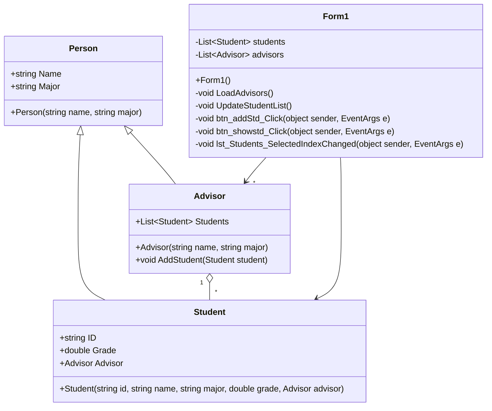

## ระบบบันทึกข้อมูลนักศึกษา
ชื่อ: นายสุรนันท์ สาทา

รหัสนักศึกษา: 673450204-9

## รายละเอียดโปรแกรม

โปรแกรมนี้เป็นระบบสำหรับอาจารย์ที่สามารถบันทึกข้อมูลนักศึกษา โดยมีรายละเอียดดังนี้:

# นักศึกษา
เก็บข้อมูลรหัสนักศึกษา, ชื่อ-นามสกุล, สาขาที่เรียน, เกรดเฉลี่ย และอาจารย์ที่ปรึกษา

# อาจารย์ที่ปรึกษา
มีชื่อ-นามสกุล, สาขาที่สอน และสามารถดูรายชื่อนักศึกษาที่อยู่ในความดูแลได้

# ฟีเจอร์หลักของโปรแกรม:

- เพิ่มนักศึกษาใหม่ พร้อมกำหนดอาจารย์ที่ปรึกษา

- แสดงรายชื่อนักศึกษาทั้งหมดที่อยู่ในระบบ

- ค้นหานักศึกษาที่มีเกรดสูงสุดและแสดงผล

- แสดงรายชื่อนักศึกษาทั้งหมดที่อยู่ในที่ปรึกษาของอาจารย์แต่ละคน

## Class Diagram

# หลักการเขียนโปรแกรมเชิงวัตถุที่ใช้ในโปรแกรม

# 1. Encapsulation 
-ใช้ Properties ({ get; set; }) ในคลาส Student และ Advisor เพื่อป้องกันการเข้าถึงข้อมูลโดยตรง
-ค่าต่างๆ เช่น ชื่อ, สาขา, เกรด, รายชื่อนักศึกษาในที่ปรึกษา ถูกควบคุมผ่านเมธอดที่กำหนด

# 2. Abstraction 
-คลาส Person ถูกออกแบบให้เป็นแม่แบบ (Super Class) ที่ใช้เก็บข้อมูลพื้นฐานของทั้ง Student และ Advisor
-แยกการทำงานของแต่ละคลาสออกจากกัน ทำให้โค้ดอ่านง่าย และสามารถพัฒนาเพิ่มเติมได้สะดวก

# 3.Inheritance 
-คลาส Student และ Advisor สืบทอดจาก คลาส Person ทำให้สามารถใช้คุณสมบัติของ Person ได้โดยไม่ต้องเขียนโค้ดซ้ำ

# 4.Polymorphism 
-เมธอด AddStudent(Student student) ใน Advisor ถูกใช้งานเพื่อเพิ่มนักศึกษาเข้ามาในรายชื่อของอาจารย์ที่ปรึกษา
-สามารถ ปรับแต่งหรือขยายเมธอดเดิม ในอนาคตเพื่อรองรับการทำงานเพิ่มเติม

# วิธีใช้งาน

1.เปิดโปรแกรมและโหลดรายชื่ออาจารย์ที่ปรึกษา

2.กรอกข้อมูลนักศึกษาและเลือกอาจารย์ที่ปรึกษา จากนั้นกดปุ่ม "เพิ่มนักศึกษา"

3.คลิกที่ "แสดงนักศึกษาที่ได้เกรดสูงสุด" เพื่อดูนักศึกษาที่มีคะแนนสูงสุดในระบบ

4.เลือกรายชื่อนักศึกษาใน ListBox เพื่อดูรายละเอียดของแต่ละคน
